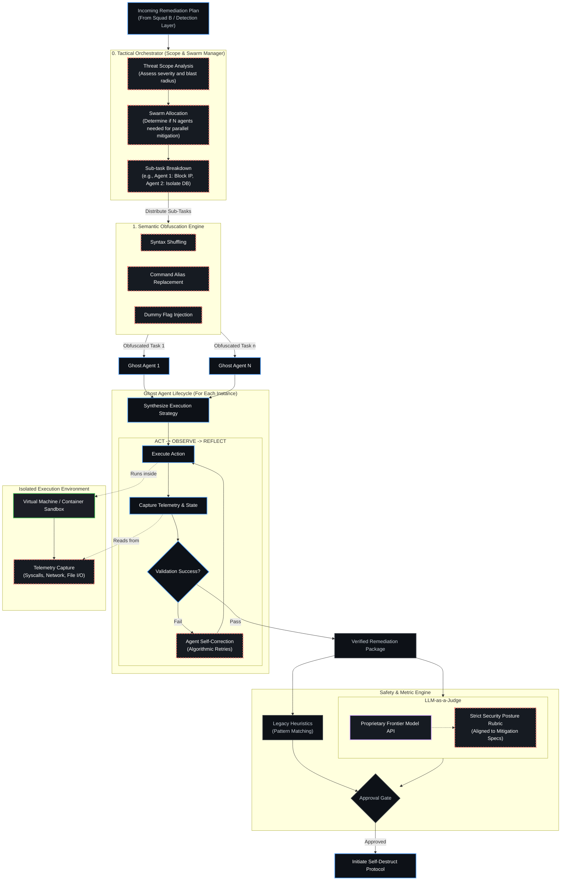

# EPD Architecture: Executive Overview (A* Upgrades)

```mermaid
flowchart TB
    %% ── Styles ──
    classDef input fill:#0d1117,stroke:#58a6ff,color:#c9d1d9,stroke-width:2px
    classDef baseline fill:#0d1117,stroke:#30363d,color:#c9d1d9,stroke-width:2px
    classDef astar fill:#161b22,stroke:#ff7b72,color:#fff,stroke-width:3px,stroke-dasharray: 4 4
    classDef agent fill:#0d1117,stroke:#58a6ff,color:#fff,stroke-width:2px
    classDef env fill:#1c1e26,stroke:#3fb950,color:#fff,stroke-width:2px
    classDef judge fill:#161b22,stroke:#d2a8ff,color:#fff,stroke-width:2px

    %% ══════════════════════════════════════
    %% TRIGGER
    %% ══════════════════════════════════════

    RemediationPlan["Incoming Remediation Plan<br/>(From Squad B / Detection Layer)"]:::input

    %% ══════════════════════════════════════
    %% 0. TACTICAL ORCHESTRATOR (NEW)
    %% ══════════════════════════════════════

    subgraph ORCHESTRATOR ["0. Tactical Orchestrator (Scope & Swarm Manager)"]
        direction TB
        ScopeAnalysis["Threat Scope Analysis<br/>(Assess severity and blast radius)"]:::astar
        SwarmSizing["Swarm Allocation<br/>(Determine if N agents needed for parallel mitigation)"]:::astar
        SubTaskBreakdown["Sub-task Breakdown<br/>(e.g., Agent 1: Block IP, Agent 2: Isolate DB)"]:::astar
        
        ScopeAnalysis --> SwarmSizing --> SubTaskBreakdown
    end

    RemediationPlan --> ORCHESTRATOR

    %% ══════════════════════════════════════
    %% 1. SEMANTIC OBFUSCATION 
    %% ══════════════════════════════════════

    subgraph POLYMORPHISM_UPGRADE ["1. Semantic Obfuscation Engine"]
        direction LR
        Tech1["Syntax Shuffling"]:::astar
        Tech2["Command Alias Replacement"]:::astar
        Tech3["Dummy Flag Injection"]:::astar
    end

    SubTaskBreakdown -->|Distribute Sub-Tasks| POLYMORPHISM_UPGRADE

    POLYMORPHISM_UPGRADE -->|Obfuscated Task 1| V1["Ghost Agent 1"]:::agent
    POLYMORPHISM_UPGRADE -->|Obfuscated Task n| V2["Ghost Agent N"]:::agent

    %% ══════════════════════════════════════
    %% 2. EPHEMERAL SWARM EXECUTION
    %% ══════════════════════════════════════

    subgraph EPHEMERAL_AGENT ["Ghost Agent Lifecycle (For Each Instance)"]
        direction TB
        GenCommand["Synthesize Execution Strategy"]:::agent
        
        subgraph REFLECTION_LOOP ["ACT -> OBSERVE -> REFLECT"]
            direction LR
            Act["Execute Action"]:::agent
            Observe["Capture Telemetry & State"]:::agent
            Reflect{"Validation Success?"}:::agent
            SelfCorrect["Agent Self-Correction<br/>(Algorithmic Retries)"]:::astar
            
            Act --> Observe --> Reflect
            Reflect -->|Fail| SelfCorrect
            SelfCorrect --> Act
        end
        
        GenCommand --> Act
    end

    V1 & V2 --> GenCommand

    %% ══════════════════════════════════════
    %% 3. SANDBOXED EXECUTION
    %% ══════════════════════════════════════

    subgraph SANDBOX ["Isolated Execution Environment"]
        direction TB
        VM["Virtual Machine / Container Sandbox"]:::env
        TeleCapture["Telemetry Capture<br/>(Syscalls, Network, File I/O)"]:::astar
        
        VM --> TeleCapture
    end

    Act -.->|"Runs inside"| VM
    Observe -.->|"Reads from"| TeleCapture

    %% ══════════════════════════════════════
    %% 4. ADVANCED EVALUATION (LLM-AS-A-JUDGE)
    %% ══════════════════════════════════════

    Reflect -->|Pass| FinalOutput["Verified Remediation Package"]:::baseline

    subgraph EVALUATION_UPGRADE ["Safety & Metric Engine"]
        direction TB
        Regex["Legacy Heuristics<br/>(Pattern Matching)"]:::baseline
        
        subgraph LLM_JUDGE ["LLM-as-a-Judge"]
            JudgeAPI["Proprietary Frontier Model API"]:::judge
            Rubric["Strict Security Posture Rubric<br/>(Aligned to Mitigation Specs)"]:::astar
            JudgeAPI -.-> Rubric
        end
        
        Regex --> Check{"Approval Gate"}:::baseline
        LLM_JUDGE --> Check
    end

    FinalOutput --> Regex
    FinalOutput --> LLM_JUDGE
    
    Check -->|Approved| Suicide["Initiate Self-Destruct Protocol"]:::agent
```
