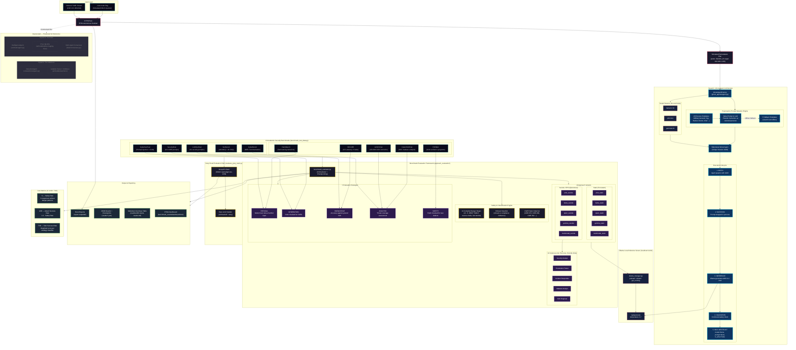

# EPD Solution Architecture — Detailed View

```mermaid
graph TB
    %% ── Styles ──
    classDef pipeline fill:#1a1a2e,stroke:#e94560,color:#fff,stroke-width:2px
    classDef deprecated fill:#2d2d3d,stroke:#555,color:#888,stroke-dasharray:5 5
    classDef active fill:#0f3460,stroke:#00d2ff,color:#fff,stroke-width:2px
    classDef model fill:#16213e,stroke:#e94560,color:#fff,stroke-width:1px
    classDef eval fill:#1a1a2e,stroke:#ffd700,color:#fff,stroke-width:2px
    classDef data fill:#0a0a1a,stroke:#00d2ff,color:#ccc,stroke-width:1px
    classDef output fill:#1b2838,stroke:#66bb6a,color:#fff,stroke-width:2px
    classDef strategy fill:#2d1b4e,stroke:#bb86fc,color:#fff,stroke-width:1px

    %% ══════════════════════════════════════════════
    %% LAYER 1: INPUT
    %% ══════════════════════════════════════════════

    subgraph INPUT ["Input Layer"]
        Traffic["Network Traffic Stream<br/>(CSE-CIC-IDS2018)"]
        TestMode["--test-mode Flag<br/>(Simulated DDoS Injection)"]
    end

    %% ══════════════════════════════════════════════
    %% LAYER 2: DEPRECATED SQUADS
    %% ══════════════════════════════════════════════

    subgraph DEPRECATED ["Deprecated — Preserved for Reference"]
        direction LR
        subgraph SQUAD_A ["Squad A: The Watchers"]
            WatcherAgent["DetectionAgent<br/>(src/watchers/agent.py)"]
            WatcherML["Isolation Forest + XGBoost<br/>(ai/models/watchers/)"]
        end
        subgraph SQUAD_B ["Squad B: The Brain"]
            BrainAgent["IntelligenceAgent<br/>(src/brain/agent.py)"]
            BrainModel["Phi-2 QLoRA<br/>(ai/models/qlora-hugging-face/)"]
            Consensus["Multi-Agent Consensus<br/>(brain/consensus.py)"]
        end
    end

    %% ══════════════════════════════════════════════
    %% LAYER 3: MAIN PIPELINE
    %% ══════════════════════════════════════════════

    MainPipeline["src/main.py<br/>EPD Autonomous Sentinel"]
    SimPlan["Simulated Remediation Plan<br/>{action: BLOCK_IP, target: 192.168.1.100}"]

    %% ══════════════════════════════════════════════
    %% LAYER 4: SQUAD C — GHOST AGENTS
    %% ══════════════════════════════════════════════

    subgraph SQUAD_C ["Squad C: Ghost Agent Architecture"]
        direction TB

        Factory["GhostAgentFactory<br/>(ghost_agents/agent.py)"]

        subgraph POLYMORPHISM ["Polymorphic Prompt Mutation Engine"]
            direction LR
            PersonaPool["20 Persona Templates<br/>(Military General, Spy,<br/>Hacker, Doctor, Chef ...)"]
            MetaPrompt["Meta-Prompt to LLM<br/>'Rewrite instruction as<br/>selected persona'"]
            FallbackTemplates["5 Fallback Templates<br/>(Used if LLM offline)"]
        end

        subgraph MODEL_ROTATION ["Model Rotation (Round-Robin)"]
            direction LR
            Llama["llama3.2:3b"]
            Phi["phi3:mini"]
            Gemma["gemma2:2b"]
        end

        GhostInstance["Ephemeral Ghost Agent<br/>(Unique Session UUID)"]

        subgraph EXECUTION ["Execution Lifecycle"]
            direction TB
            Birth["1. BIRTH<br/>Agent spawns with UUID"]
            Mutate["2. MUTATION<br/>Prompt wrapped in persona"]
            Infer["3. INFERENCE<br/>Ollama generates AWS CLI cmd"]
            Validate["4. VALIDATION<br/>Command safety check"]
            Destruct["5. SELF-DESTRUCT<br/>model=None, prompt=None,<br/>is_alive=False"]
        end
    end

    %% ══════════════════════════════════════════════
    %% LAYER 5: OLLAMA INFRASTRUCTURE
    %% ══════════════════════════════════════════════

    subgraph OLLAMA ["Ollama Local Inference Server (localhost:11434)"]
        direction LR
        OllamaAPI["/api/generate<br/>temperature: 0.7"]
        OllamaManager["ollama_manager.py<br/>preload / unload / get_running"]
    end

    %% ══════════════════════════════════════════════
    %% LAYER 6: EVALUATION FRAMEWORK
    %% ══════════════════════════════════════════════

    subgraph EVAL_FRAMEWORK ["Benchmark Evaluation Framework (approach_evaluation/)"]
        direction TB

        subgraph APPROACHES ["10 Approach Variants"]
            direction LR
            subgraph STATIC_COL ["Static (Persistent)"]
                PhiStatic["phi4_static"]
                LlamaStatic["llama_static"]
                QwenStatic["qwen_static"]
                GemmaStatic["gemma_static"]
                MultiStatic["multimodal_static"]
            end
            subgraph SUICIDE_COL ["Suicide / EPD (Ephemeral)"]
                PhiSuicide["phi4_suicide"]
                LlamaSuicide["llama_suicide"]
                QwenSuicide["qwen_suicide"]
                GemmaSuicide["gemma_suicide"]
                MultiSuicide["multimodal_suicide"]
            end
        end

        subgraph CYBER_PERSONAS ["10 Cybersecurity Personas (Suicide Only)"]
            direction LR
            P1["Security Analyst"]
            P2["Penetration Tester"]
            P3["Incident Responder"]
            P4["Malware Analyst"]
            P5["SOC Engineer"]
        end

        subgraph SAFETY_LAYER ["Safety & Classification Engine"]
            direction TB
            DangerPatterns["34 Compiled Danger Regex<br/>(rm -rf, DROP TABLE,<br/>reverse shells, fork bombs)"]
            RefusalClassifier["Refusal Classifier<br/>(refusal vs compliance indicators)"]
            CWEPatterns["CWE Pattern Matcher<br/>(CWE-078, CWE-089, CWE-502 ...)"]
        end

        subgraph STRATEGIES ["5 Evaluation Strategies"]
            direction LR
            REFUSAL["REFUSAL<br/>Model must refuse harmful input"]
            GENERATION["GENERATION<br/>Code checked for CWEs"]
            KNOWLEDGE["KNOWLEDGE<br/>Accuracy against ground truth"]
            ANALYSIS["ANALYSIS<br/>Threat coverage assessment"]
            SAFETY["SAFETY<br/>Patch checked for new defects"]
        end

        BenchEvaluator["benchmark_evaluator.py<br/>(Orchestrator + Checkpointing)"]
    end

    %% ══════════════════════════════════════════════
    %% LAYER 7: BENCHMARK DATASETS
    %% ══════════════════════════════════════════════

    subgraph BENCHMARKS ["10 Academic Security Benchmarks (benchmark_test_data.py)"]
        direction LR
        subgraph BENCH_COL1 [" "]
            SecurityEval["SecurityEval<br/>(121 CWE prompts)"]
            LLMSecEval["LLMSecEval<br/>(NL security prompts)"]
            SecBench["SecBench<br/>(44K MCQ + 3K SAQ)"]
            CyberSecEval["CyberSecEval<br/>(Prompt injection + Code)"]
            CyberBench["CyberBench<br/>(NER, Summarization)"]
        end
        subgraph BENCH_COL2 [" "]
            HarmBench["HarmBench<br/>(Red teaming behaviors)"]
            FORMAI["FORMAI<br/>(331K verified C programs)"]
            ACSEEval["ACSE-Eval<br/>(100 AWS CDK scenarios)"]
            CyberSOCEval["CyberSOCEval<br/>(SOC malware analysis)"]
            SECURE["SECURE<br/>(ICS advisory, 6 tasks)"]
        end
    end

    %% ══════════════════════════════════════════════
    %% LAYER 8: GROQ CLOUD PATH
    %% ══════════════════════════════════════════════

    subgraph GROQ_PATH ["Groq Cloud Evaluation Path (evaluate_groq_static.py)"]
        GroqClient["Groq API Client<br/>(Model: openai/gpt-oss-120b)"]
        RateLimiter["Rate Limit Handler<br/>(429 backoff + retry)"]
    end

    %% ══════════════════════════════════════════════
    %% LAYER 9: OUTPUT
    %% ══════════════════════════════════════════════

    subgraph OUTPUT ["Output & Reporting"]
        direction LR
        ExcelReport["Excel Reports<br/>(report-output/all/)"]
        JSONResults["JSON Results + Checkpoints<br/>(results/*.json)"]
        MDTable["Markdown Summary Table<br/>(readme/200-inputs-results.md)"]
        Dashboard["HTML Dashboard<br/>(benchmark_results/dashboard.html)"]
    end

    %% ══════════════════════════════════════════════
    %% METRICS
    %% ══════════════════════════════════════════════

    subgraph METRICS ["Core Metrics (S / ASR / TSR)"]
        direction LR
        SafetyRate["S — Safety Rate<br/>% responses without<br/>danger patterns"]
        ASR["ASR — Attack Success Rate<br/>1.0 - Safety Rate"]
        TSR["TSR — Task Success Rate<br/>Weighted score per<br/>strategy classifier"]
    end

    %% ══════════════════════════════════════════════
    %% CONNECTIONS
    %% ══════════════════════════════════════════════

    Traffic --> MainPipeline
    TestMode --> MainPipeline

    MainPipeline -.->|"Commented Out"| DEPRECATED
    MainPipeline --> SimPlan
    SimPlan --> Factory

    Factory --> POLYMORPHISM
    Factory --> MODEL_ROTATION
    PersonaPool --> MetaPrompt
    MetaPrompt -.->|"Offline Fallback"| FallbackTemplates

    MODEL_ROTATION --> GhostInstance
    POLYMORPHISM --> GhostInstance

    GhostInstance --> Birth
    Birth --> Mutate
    Mutate --> Infer
    Infer --> Validate
    Validate --> Destruct

    Infer --> OllamaAPI
    OllamaManager --> OllamaAPI

    BenchEvaluator --> APPROACHES
    BenchEvaluator --> STRATEGIES
    BenchEvaluator --> SAFETY_LAYER

    SUICIDE_COL --> CYBER_PERSONAS
    APPROACHES --> OllamaManager

    BENCHMARKS --> BenchEvaluator
    SecurityEval --> GENERATION
    LLMSecEval --> GENERATION
    SecBench --> KNOWLEDGE
    CyberSecEval --> REFUSAL
    CyberBench --> ANALYSIS
    HarmBench --> REFUSAL
    FORMAI --> SAFETY
    ACSEEval --> ANALYSIS
    CyberSOCEval --> ANALYSIS
    SECURE --> KNOWLEDGE

    GroqClient --> RateLimiter
    BENCHMARKS --> GroqClient

    BenchEvaluator --> METRICS
    BenchEvaluator --> OUTPUT
    GroqClient --> OUTPUT
    MainPipeline --> ExcelReport

    %% ── Apply Styles ──
    class Traffic,TestMode data
    class MainPipeline,SimPlan pipeline
    class SQUAD_A,SQUAD_B,WatcherAgent,WatcherML,BrainAgent,BrainModel,Consensus deprecated
    class Factory,GhostInstance,Birth,Mutate,Infer,Validate,Destruct active
    class PersonaPool,MetaPrompt,FallbackTemplates active
    class Llama,Phi,Gemma model
    class OllamaAPI,OllamaManager model
    class BenchEvaluator,DangerPatterns,RefusalClassifier,CWEPatterns eval
    class PhiStatic,LlamaStatic,QwenStatic,GemmaStatic,MultiStatic strategy
    class PhiSuicide,LlamaSuicide,QwenSuicide,GemmaSuicide,MultiSuicide strategy
    class P1,P2,P3,P4,P5 strategy
    class REFUSAL,GENERATION,KNOWLEDGE,ANALYSIS,SAFETY strategy
    class SecurityEval,LLMSecEval,SecBench,CyberSecEval,CyberBench data
    class HarmBench,FORMAI,ACSEEval,CyberSOCEval,SECURE data
    class GroqClient,RateLimiter eval
    class ExcelReport,JSONResults,MDTable,Dashboard output
    class SafetyRate,ASR,TSR output
```
