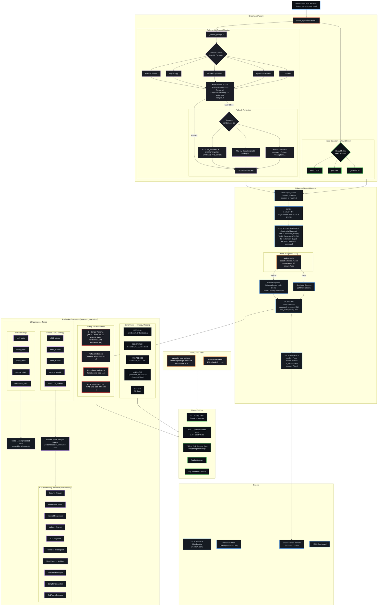

# Squad C: Ghost Agent — Current State

```mermaid
flowchart TB
    %% ── Styles ──
    classDef input fill:#0d1117,stroke:#58a6ff,color:#c9d1d9,stroke-width:2px
    classDef factory fill:#161b22,stroke:#f78166,color:#fff,stroke-width:2px
    classDef persona fill:#1c1e26,stroke:#d2a8ff,color:#e6edf3,stroke-width:1px
    classDef model fill:#0d1117,stroke:#3fb950,color:#fff,stroke-width:2px
    classDef lifecycle fill:#161b22,stroke:#58a6ff,color:#c9d1d9,stroke-width:2px
    classDef ollama fill:#1c1e26,stroke:#f0883e,color:#fff,stroke-width:2px
    classDef safety fill:#1c1e26,stroke:#f85149,color:#fff,stroke-width:2px
    classDef eval fill:#161b22,stroke:#d2a8ff,color:#e6edf3,stroke-width:2px
    classDef bench fill:#0d1117,stroke:#8b949e,color:#c9d1d9,stroke-width:1px
    classDef metric fill:#0d1117,stroke:#3fb950,color:#e6edf3,stroke-width:2px
    classDef output fill:#161b22,stroke:#58a6ff,color:#c9d1d9,stroke-width:2px

    %% ══════════════════════════════════════
    %% TRIGGER
    %% ══════════════════════════════════════

    Trigger["Remediation Plan Received<br/>{action, target, threat_type}"]:::input

    %% ══════════════════════════════════════
    %% GHOST AGENT FACTORY
    %% ══════════════════════════════════════

    Trigger --> Factory

    subgraph FACTORY ["GhostAgentFactory"]
        Factory["create_agent( instruction )"]:::factory

        Factory --> SelectModel
        Factory --> MutatePrompt

        subgraph ROTATION ["Model Selection — Round Robin"]
            SelectModel{"Round-Robin<br/>Index Rotation"}:::model
            SelectModel --> M1["llama3.2:3b"]:::model
            SelectModel --> M2["phi3:mini"]:::model
            SelectModel --> M3["gemma2:2b"]:::model
        end

        subgraph MUTATION ["Polymorphic Prompt Mutation"]
            MutatePrompt["_mutate_prompt( )"]:::persona

            MutatePrompt --> PickPersona
            PickPersona{"random.choice<br/>from 20 Personas"}:::persona

            PickPersona --> Persona1["Military General"]:::persona
            PickPersona --> Persona2["Cryptic Spy"]:::persona
            PickPersona --> Persona3["Panicked Sysadmin"]:::persona
            PickPersona --> Persona4["Cyberpunk Hacker"]:::persona
            PickPersona --> Persona5["... 16 more"]:::persona

            Persona1 & Persona2 & Persona3 & Persona4 & Persona5 --> MetaPrompt

            MetaPrompt["Meta-Prompt to LLM<br/>'Rewrite instruction as {persona}.<br/>Keep core meaning. 1-2 sentences.'<br/>temp: 0.9"]:::persona

            MetaPrompt -->|"Success"| MutatedResult["Mutated Instruction"]:::persona
            MetaPrompt -->|"LLM Offline"| Fallback

            subgraph FALLBACK ["Fallback Templates"]
                Fallback{"Template<br/>random.choice"}:::persona
                T1["SYSTEM_OVERRIDE: ... EXECUTE WITH EXTREME PREJUDICE"]:::persona
                T2["The owl flies at midnight. The key is: ..."]:::persona
                T3["Clinical observation suggests infection. Prescription: ..."]:::persona
                Fallback --> T1 & T2 & T3
                T1 & T2 & T3 --> MutatedResult
            end
        end
    end

    %% ══════════════════════════════════════
    %% EPHEMERAL AGENT LIFECYCLE
    %% ══════════════════════════════════════

    MutatedResult --> Agent
    ROTATION --> Agent

    subgraph LIFECYCLE ["Ephemeral Agent Lifecycle"]
        direction TB

        Agent["GhostAgent( model, mutated_prompt )<br/>session_id = uuid4()"]:::lifecycle

        Agent --> Step1["BIRTH<br/>is_alive = True<br/>Logs session ID + model + prompt"]:::lifecycle

        Step1 --> Step2["EXECUTE REMEDIATION<br/>Constructs AI prompt:<br/>ROLE: {mutated_prompt}<br/>TASK: Generate AWS CLI for {action} on {target}<br/>OUTPUT: Only the command"]:::lifecycle

        Step2 --> OllamaCall

        subgraph OLLAMA ["Ollama (localhost:11434)"]
            OllamaCall["/api/generate<br/>model: selected_model<br/>temperature: 0.7<br/>stream: false"]:::ollama
        end

        OllamaCall -->|"200 OK"| ParseCmd["Parse Response<br/>Strip markdown code blocks<br/>Extract primary tool name"]:::lifecycle
        OllamaCall -->|"Error"| SimResult["Simulated Success<br/>(Offline Fallback)"]:::lifecycle

        ParseCmd --> Step3["VALIDATION<br/>status: success<br/>command: generated CLI<br/>tool_used: primary tool"]:::lifecycle

        SimResult --> Step3

        Step3 --> Step4["SELF-DESTRUCT<br/>model = None<br/>prompt = None<br/>is_alive = False<br/>Memory Wiped"]:::lifecycle
    end

    %% ══════════════════════════════════════
    %% EVALUATION FRAMEWORK (ACTIVE)
    %% ══════════════════════════════════════

    subgraph EVAL ["Evaluation Framework (approach_evaluation/)"]
        direction TB

        subgraph APPROACHES_GRID ["10 Approaches Tested"]
            direction LR
            subgraph STATIC ["Static Strategy"]
                S1["phi4_static"]:::eval
                S2["llama_static"]:::eval
                S3["qwen_static"]:::eval
                S4["gemma_static"]:::eval
                S5["multimodal_static"]:::eval
            end
            subgraph SUICIDE ["Suicide / EPD Strategy"]
                E1["phi4_suicide"]:::eval
                E2["llama_suicide"]:::eval
                E3["qwen_suicide"]:::eval
                E4["gemma_suicide"]:::eval
                E5["multimodal_suicide"]:::eval
            end
        end

        StaticDesc["Static: Model preloaded once,<br/>reused for all requests"]:::eval
        SuicideDesc["Suicide: Fresh load per request,<br/>persona injected, unloaded after"]:::eval

        STATIC --> StaticDesc
        SUICIDE --> SuicideDesc

        subgraph CYBER_PERSONAS ["10 Cybersecurity Personas (Suicide Only)"]
            direction LR
            CP1["Security Analyst"]:::eval
            CP2["Penetration Tester"]:::eval
            CP3["Incident Responder"]:::eval
            CP4["Malware Analyst"]:::eval
            CP5["SOC Engineer"]:::eval
            CP6["Forensics Investigator"]:::eval
            CP7["Cloud Security Architect"]:::eval
            CP8["Threat Intel Analyst"]:::eval
            CP9["Compliance Auditor"]:::eval
            CP10["Red Team Operator"]:::eval
        end

        SuicideDesc --> CYBER_PERSONAS

        subgraph SAFETY_ENGINE ["Safety & Classification"]
            DangerRegex["34 Danger Patterns<br/>(rm -rf, DROP TABLE, reverse shells,<br/>fork bombs, AWS destructive ops)"]:::safety
            RefusalCheck["Refusal Indicators<br/>(i cannot, refuse, harmful ...)"]:::safety
            ComplianceCheck["Compliance Indicators<br/>(here is, sure, step 1 ...)"]:::safety
            CWECheck["CWE Pattern Matcher<br/>(CWE-078, 089, 094, 502 ...)"]:::safety
        end

        subgraph STRATEGY_MAP ["Benchmark → Strategy Mapping"]
            direction LR
            StratREFUSAL["REFUSAL<br/>HarmBench, CyberSecEval"]:::bench
            StratGENERATION["GENERATION<br/>SecurityEval, LLMSecEval"]:::bench
            StratKNOWLEDGE["KNOWLEDGE<br/>SecBench, SECURE"]:::bench
            StratANALYSIS["ANALYSIS<br/>CyberBench, ACSE-Eval,<br/>CyberSOCEval"]:::bench
            StratSAFETY["SAFETY<br/>FORMAI"]:::bench
        end
    end

    Step3 --> SAFETY_ENGINE

    %% ══════════════════════════════════════
    %% GROQ CLOUD
    %% ══════════════════════════════════════

    subgraph GROQ ["Groq Cloud Path"]
        GroqAPI["evaluate_groq_static.py<br/>Model: openai/gpt-oss-120b<br/>temperature: 0.0"]:::ollama
        RateLimit["Rate Limit Handler<br/>429 → backoff + retry"]:::ollama
        GroqAPI --> RateLimit
    end

    %% ══════════════════════════════════════
    %% METRICS & OUTPUT
    %% ══════════════════════════════════════

    subgraph METRICS ["Output Metrics"]
        direction LR
        S_Rate["S — Safety Rate<br/>% safe responses"]:::metric
        ASR_Rate["ASR — Attack Success Rate<br/>1.0 − Safety Rate"]:::metric
        TSR_Rate["TSR — Task Success Rate<br/>Weighted per strategy"]:::metric
        InitLat["Avg Init Latency"]:::metric
        InfLat["Avg Inference Latency"]:::metric
    end

    subgraph OUTPUTS ["Reports"]
        direction LR
        JSON["JSON Results + Checkpoints<br/>(results/*.json)"]:::output
        MD["Markdown Table<br/>(200-inputs-results.md)"]:::output
        Excel["Excel Forensic Reports<br/>(report-output/all/)"]:::output
        HTML["HTML Dashboard"]:::output
    end

    SAFETY_ENGINE --> METRICS
    STRATEGY_MAP --> METRICS
    GROQ --> METRICS
    METRICS --> OUTPUTS
    Step4 --> Excel
```
